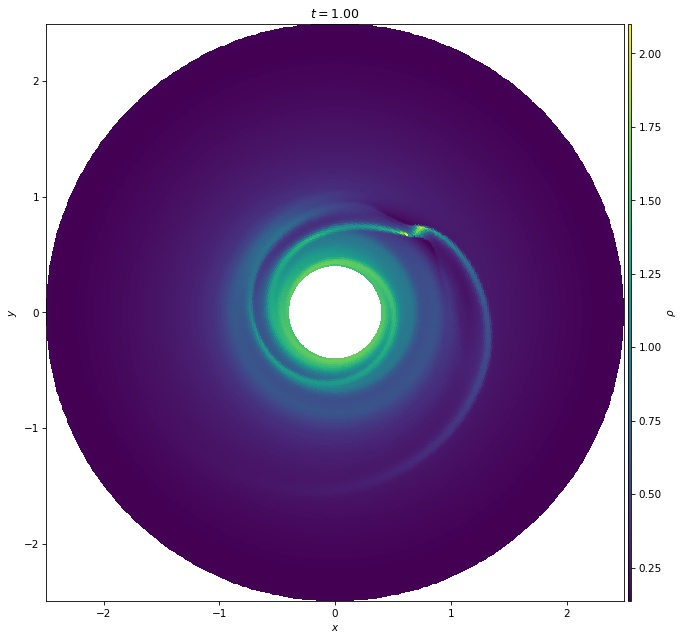
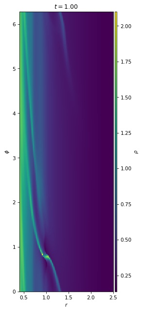
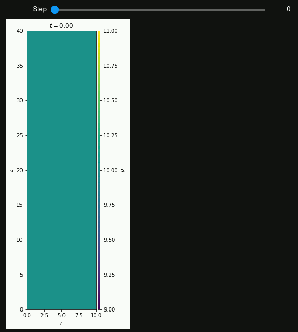

# plutoplot - Plutocode data loading and plotting library

[](https://plutoplot.readthedocs.io/en/latest/?badge=latest)
[](https://github.com/Simske/plutoplot/actions/workflows/pre-commit.yml)
[](https://github.com/Simske/plutoplot/actions/workflows/tox.yml)

[](https://github.com/psf/black)
[](https://pycqa.github.io/isort/)

`plutoplot` is a Python package for loading, analyzing and plotting data from the [astrophysical gas dynamics simulation code PLUTO](http://plutocode.ph.unito.it/).
By handling simulations as a whole and loading data only when needed (lazy loading), it is fast and easy to use.

It features:
- Loading on data actually needed (by lazy loading in memory mapping)
- easy slicing into large datasets (e.g. plotting 2D slice of 3D dataset)
- plotting non-cartesian coordinates projected into cartesian space
- interactive plotting in Jupyter Notebooks
- CLI tool to quickly acquire information about simulations
- Access to parameters set in `definitions.h` and `pluto.ini`
- Access to simulation metadata and grid properties
- Indexing with `ijk` (like `pyPLUTO`) and `kji` (like PLUTO internally) schemes

There is currently no support for:
- Particles
- Adaptive grids (AMR)
- 3D plotting (only plotting 2D slices of 3D data is supported.)

To get started with `plutoplot` check out the [documentation](https://plutoplot.readthedocs.io/en/latest/) and [examples](https://github.com/Simske/plutoplot/tree/main/test).

## Installation
`plutoplot` requires Python >=3.6. Make sure for installation to install in the right environment, and/or adapt the pip commands accordingly (e.g. `pip3`).

The base version of plutoplot can be installed from Pypi with:
```bash
pip install --upgrade plutoplot
```

To keep the installation size small the dependencies for interactive plotting and loading of HDF5 data are declared as optional dependencies.
To install the optional dependencies use either of the following, depeding on your needs:
```bash
pip install --upgrade plutoplot[interactive]
pip install --upgrade plutoplot[hdf5]
pip install --upgrade plutoplot[interactive,hdf5]
```

To install the current development version from this branch:
```bash
pip install --upgrade "plutoplot @ git+https://github.com/simske/plutoplot"
```

## Quick Start
### CLI: check simulation info
To quickly check the status of a PLUTO simulation, you can use the `pluto-info` command line tool:
```bash
pluto-info /path/to/simulation
```
Sample:
```
>> pluto-info test-problems/HD/Jet/01/
PLUTO simulation at 'test-problems/HD/Jet/01'
Polar grid with dimensions (160, 1, 640)
Domain: x1: 0.00e+00 .. 1.00e+01 (Lx1 = 1.00e+01)
        x2: 0.00e+00 .. 1.00e+00 (Lx2 = 1.00e+00)
        x2: 0.00e+00 .. 4.00e+01 (Lx3 = 4.00e+01)
Available variables: rho vx1 vx2 vx3 prs
Data files:
    Format dbl: 16 files, last time 15.0, data timestep 1.00e+00
    Format flt: 61 files, last time 15.0, data timestep 2.50e-01

```
(note: depending on your Python environment, the entrypoint `pluto-info` might not be installed correctly. Check the [documentation for more details](https://plutoplot.readthedocs.io/en/latest/cli-tools)).

### Quick start in Python scripts / Jupyter notebooks
```python
import plutoplot as pp
```
#### Basics
Simulations can be loaded by just providing the path to the simulation directory (directory with `definitions.h` and `pluto.ini`).
The data directory is the found automatically, as well as the grid geometry.
The formats are searched in the order (dbl, flt, vtk, dbl.h5, flt.h5) and the first found loaded, this can be overriden.
```python
sim = pp.Simulation("/path/to/simulation", format="flt")
```
The simulation object provides access to all outputs (of this format), the grid and simulation metadata.
A few examples of accesible attributes:
```python
sim.dims                  # domain resolution
sim.x1, sim.x2, sim.x3    # cell centered coordinates, redirect to sim.grid.x{1,2,3}
sim.x1i, sim.x2i, sim.x3i # cell interface coordinates
sim.Lx1, sim.Lx2, sim.Lx3

sim.t                     # simulation output times
sim.vars                  # simulation output variables
```

The data at the specific output steps can be accessed with the `sim[n]` syntax.
This results in a `PlutoData` object, which can be used to access the data:
```python
sim[-1].rho
```
The data object as well as the data array are generated when needed, and the data arrays are memory mapped, which means only data actually accessed is read from disk.
The names of the data variables can be found with `sim.vars`.

Be aware that data arrays are always 3-dimensional, even if the domain has a resolution of 1 in some directions.
This is for clarity and consistency, so that an axis always has a direct correspondence to its coordinates in the grid.

Simulations are iterable:
```python
for step in sim:
    print("Total mean squared velocity at t={step.t}: ", (step.vx1**2 + step.vx2**2 + step.vx3**2).mean())
```
And also provide a `reduce()` function to run over the whole simulation:
```python
prs_mean = sim.reduce(lambda step: step.prs.mean())
```
This results in an array containing the output of the supplied function for each step, in the example the mean pressure.

#### Working with simulation slices
To only look at a part of a simulation we can slice into it.
This can be particularly useful for analyzing and plotting 2D slices of 3D data, as full 3D plotting is not supported yet.
To slice into a simulation the usual slicing syntax on `Simulation.slicer`:
```python
sliced_sim = sim.slicer[:,0,32:64]
```
This sliced simulation object can now be used as the normal simulation object.
The grid and data arrays will automatically return the data for this slice.
(Note: for clarity a 3D slice is always required. The data arrays will still always be 3D, see above).

#### Plotting
`plutoplot` provides automatic plotting for 1D & 2D simulations.
To plot slices of 3D simulations, first create a simulation slice (section above), then just follow normally.

The PlutoData object provides a `plot()` function, which will automatically project the data onto a cartesian grid, and annotating the axes and colorbar correctly:
```python
sim[-1].plot('rho')
```


The projection can also be turned off, an arbitrary options which will be passed to matplotlib can be given:
```python
sim[-1].plot('rho', projection=False)
```


If a plot of a custom quantitity is needed, a array instead of a variable name can be given:
```
step = sim[-1]
step.plot(step.prs / step.rho, label="T")
```

In Jupyter Notebooks interactive plotting can be used to step through the simulation steps.
`Simulation.iplot()` has the same interface as `PlutoData.plot()`, but it will show a slider to step through simulation steps:
```
sim.iplot("rho")
```


## Testing
The test suite for `plutoplot` can be found in `test/` and is run by Github actions using `tox` and `pytest`.

The test suite is currently minimal and has low code coverage. It will be expanded in the future to ensure correctness.

## Contributing
If you have any questions, suggestions or find a bug, feel free to open an [issue](https://github.com/Simske/plutoplot/issues)
or [Pull Request](https://github.com/Simske/plutoplot/pulls), I am happy to accept contributions to make plutoplot better.

`plutoplot` uses [pre-commit](https://pre-commit.com/) to ensure a consistend code style, please use it when opening a Pull Request.

## License
GPLv3
